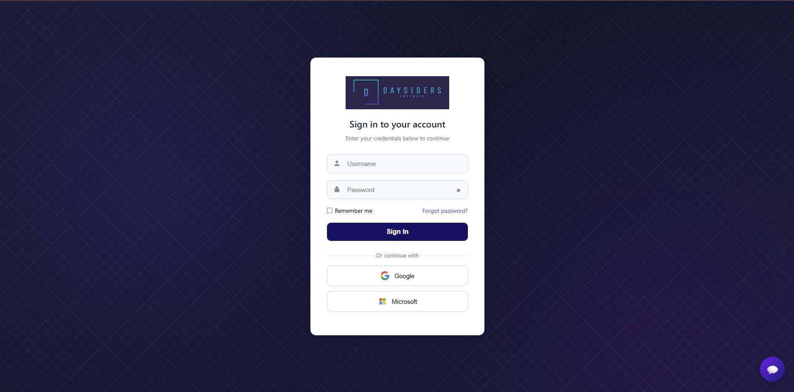

# Daysiders-App

## About This Project

Daysiders-App is a digital library and gallery management tool designed to help users **store, organize, and access ebooks and pictures** in one place.  

### Key Features
-  Maintain and categorize ebooks for easy reading
-  Upload and organize pictures into collections
-  Search and filter content quickly
-  Cloud-based storage for accessibility across devices
-  Clean and user-friendly interface

This project aims to provide a **simple yet powerful platform** for anyone who wants to keep their digital reading materials and images neatly organized.
Its still in its begining development stage.

### What has been completed.
-  Login Page with CSS and HTML

## Future Update's 

